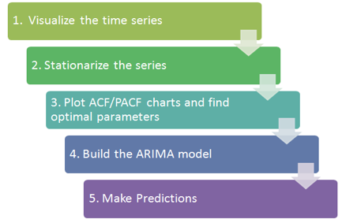

##  Time Series Analysis

- Tesla Stock Forecasting by Time Series Models
By getting the Tesla Company’s stock information (NASDAQ: TSLA) through the Yahoo Finance. This project will apply the time series analysis methods to investigate the TSLA’s basic information, decompose the TLSA’s time series. 
- The exponential smoothing methods to forecast the TSLA’s price in the coming 365 days, and then will use 
- The ARIMA model to predict the price. 
This project also will check the Then we forecast error distribution to check the model’s performance.

## Decompose the Time Series

Decomposing a time series means separating it into its constituent components, which are usually a trend component and an irregular component, and if it is a seasonal time series, a seasonal component. For the TSLA stock information, from the price trend plot figure, we can see that there is not seasonal component inside the data. But this time series data should include a trend component and an irregular component. Decomposing the time series involves trying to separate the time series into these components, that is, estimating the trend component and the irregular component. We will SMA() function to smooth TSLA data. We will choose the different order (n=8 and n=40) to check the trend component. The goal is that we try to smoothed the data with a simple move average.
 
## Forecast Model and Evaluation: Exponential Smoothing

- Exponential Smoothing Model    
Exponential Smoothing model can be used to make the short-term forecasts for time series data. From the TSLA data, we know it can be described as the additive model with no seasonality. From the trend chart, we can see the random fluctuations in the time series seem to be roughly constant in size over time. So we will use the HoltWinter() function to fit a simple exponential smoothing prediction.

## Forecast Model and Evaluation: ARIMA Model

ARIMA Model

ARIMA (Autoregressive Integrated Moving Average) is a major tool used in time series analysis to attempt to forecast future values of a variable based on its present value. ARIMA(p,d,q) forecasting equation: ARIMA models are, in theory, the most general class of models for forecasting a time series which can be made to be “stationary” by differencing. ARIMA models are defined for stationary time series. Therefore, if you start off with a non-stationary time series, you will first need to ‘difference’ the time series until you obtain a stationary time series.  To difference the time series d times to obtain a stationary series, we use the diff() function. Then we will use the A formal ADF test does not reject the null hypothesis of non-stationarity, confirming our visual inspection: 

We can see the ADF.test result. Before diff(), the p-value is 0.7165 and after diff(), the p-value is 0.01. So logTeslaStockData_Diff1 is the stationary time series and ready for ARIMA model.

## Prediction

## Summary

In this section, we use the TESLA stock data as time series. We decompose it and use the HoltWinter exponential smoothing and ARIMA to forecast the future stock price. The basic procedures are as the following figure.
 
The other thing is we should always to analysis the errors and tune model parameters to achieve the better results.

